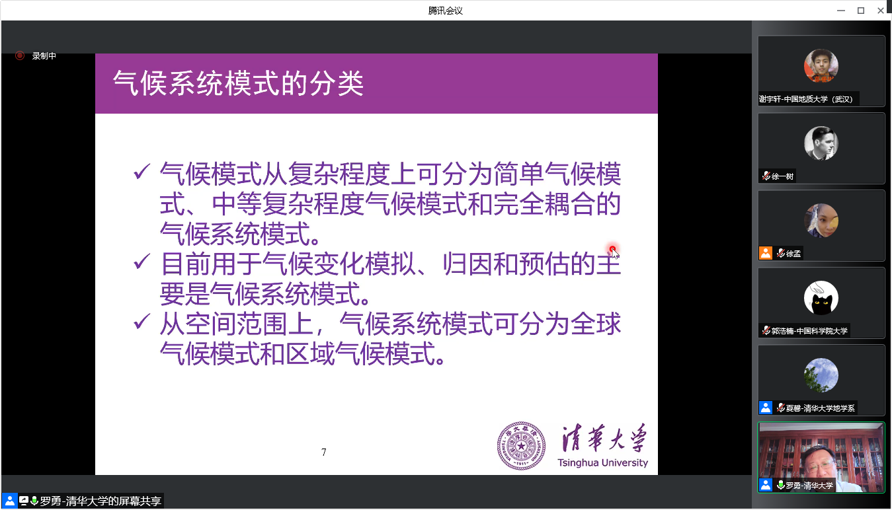
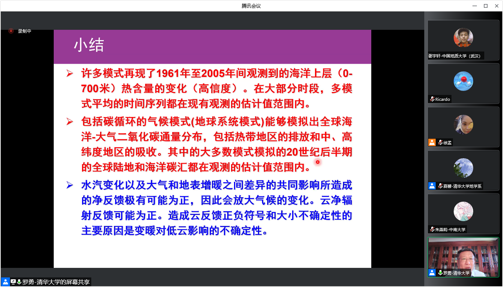
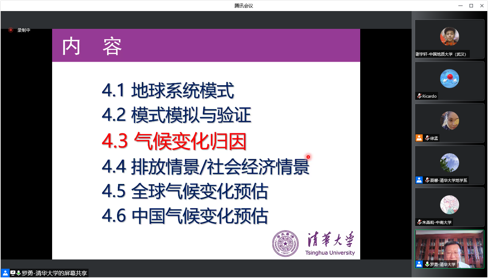

[toc]

---

2022 年地球系统模式研发及应用国际暑期学校

---

# 2022-08-22 地球系统模式介绍——罗勇

## 地球系统模式

动态植被：在一定温度、降水等条件下，可以模拟植被生长，显示囊括进模式种

CMIP：耦合模式比较计划，模式不同，计算方式相同。实现模式之间的横向比较，以提升各自模式能力。

水平分辨率：50公里左右

大气模式动力框架

前三：直角坐标系的牛顿第二定律；四：连续性方程，物质守恒；六：理想气体状态方程

牛儿-物质守恒-热一-理想气体状态方程

地球环境下成立

**有限差分方法**进行空间离散化，人为划定网格——水平分辨率、垂直分辨率

水平分辨率要比研究对象尺度小

**走向精细化**

空气过饱和状态 **->** 空气上升运动 **->** ...

空间尺度小 -> **参数化过程**

生态：**叶片气孔**

**模式模拟飓风移动路径**

基本动力、物理、化学原理

如何算？

`Fortran`：适合**高性能计算**

`!`：注释

$C_s$看某一个方程有没有云

美国CESM模式、THU-CIESM模式->超过160w行

**如何更好发挥目前计算机的能力？模式与高算匹配问题**

NCAR（N卡儿）

全球 -> 区域

优点：**提升空间分辨率、重要的过程特点更为集中、模式发展性能更好**

原因：**分辨率不足**

**RCM：区域气候模式**

## 模式模拟与验证

**纵坐标：变量**

**横坐标：每个模式的均方根误差-多模式平均的均方根误差**

***蓝色越多越好***

> 做模型最好使用多模式，效果更好，消除不确定性，更为保险，模拟能力更好。

**耦合模式比较计划CMIP**：统一模式数值实验的方案，几十个模式都一样来做数值实验，只是模式不同，多家模式统一上传到国际共享网络上【自己有模式，同时又能拿到别人的模式】

## 气候变化归因

**气候变暖趋势越来越强**

**指纹法：用于归因**

温室气体排放——

气溶胶排放——阳伞效应，减小

温室气体排放情景（可能性、假设）

>  提前预测高温、热浪、干旱的威胁
>
> **归因、预估两方面**
>
> 水文系统、粮食、生态、等领域遭受到气候变化的不利影响（气候变化的风险），这些都是气候变化模式的重要领域。

Q1：气候骗局是否是受益者主导的问题？

A1：

人类活动是气候变化最主要的原因

80年代以后，人类活动成主导因素

非科学：

- 经济利益：深度减少温室气体排放。化石能源遭受损失。涉及行业利益。
- 政治原因：地缘政治。

Q2：耦合器

A2：

大气、海洋、陆面、冰雪等通量的耦合传递。不同的分量模式耦合得更好，使模式积分的总体性能更好。

空间与时间的插值

---

早已使用确定论是由于观测数据十分有限，

未来展望：基于大数据的地球系统模式，完全依靠深度学习建模

# 2022-08-23 陆面过程模拟——戴永久

# 2022-08-23 地球系统模式评估——周天军

# 2022-08-24 地球系统模式耦合器——刘利

# 2022-08-24 安装和配置WRF培训——刘帅

# 2022-08-24 Infrastructure, GHG emissions and climate change——D’ Maris Coffman

# 2022-08-25  Coupled Modeling System for Polar Sea Ice and Climate Prediction – Progress and Challenge——Jiping Liu

# 2022-08-25 超算竞赛优化培训——叶晋甫

# 2022-08-25 Land surface modelling: linking ecosystems and climate——Iain Colin Prentice

# 2022-08-26 模式研发支撑系统与智能模式发展——黄小猛

