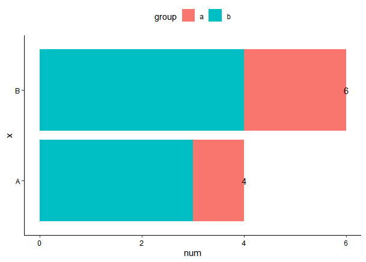

[toc]

# 2022-05-16

> 实现了利用`geom_text`向`face_grid`中不同子图中插入不同label

```R
library(tidyverse)
load('C:/Users/kong/Desktop/Draw.rdata')
## label
lab_text <- long %>% 
  as_tibble() %>% 
  group_by(class, group) %>% 
  select(Class) %>% 
  unique() %>% 
  mutate(y_lab = ifelse(class == 'Non', 0.3, 0.8),
         x_lab = 1)
## figures
long %>% 
  as_tibble() %>% 
  ggplot(aes(x = Time, y = `Relative expression`)) + theme_bw() +
  geom_line(mapping = aes(group = Type, color = Type, linetype = Type),
            stat = 'summary', fun = 'median', color = 'brown') +
  theme(
    legend.position = 'top'
  ) +
  geom_text(data = lab_text, 
            mapping = aes(x = x_lab, y = y_lab, label = Class),
            hjust = 0, vjust = 0) +
  facet_grid(class~group, scales = 'free')
```

> 效果展示
>
> 

# 2022-05-28

> 堆叠柱状图以及`geom_text`添加注释

```R
pacman::p_load(tidyverse, data.table)

d <- data.table(num = c(1, 2, 3, 4), 
                x = c('A', 'B', 'A', 'B'),
                group = c('a', 'a', 'b', 'b'))

lab <- d[, by = x, .(label = toString(sum(num)))]

d %>% 
  ggplot(aes(x = x, y =num)) + theme_classic() +
  geom_bar(aes(fill = group), stat = 'identity') +
  geom_text(data = lab, aes(x = x, y = as.numeric(label),
                            label = label)) +
  coord_flip() +
  theme(
    legend.position = 'top',
    axis.text = element_text(color = 'black')
  )
```

> 效果展示
>
> 

# 2022-06-02 根据列内容筛选列

```R
# Filter columns that are not all pass
tibble(col_1 = rep('pass', 5), 
       col_2 = rep(1, 5), 
       col_3 = rep('pass', 5)) %>% 
  select(
    where(~ unique(.x) != 'pass')
  )
```

