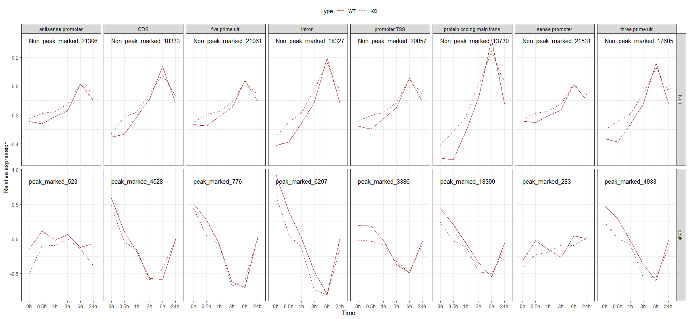

[toc]

# 2022-05-16 王小文

> 实现了利用`geom_text`向`face_grid`中不同子图中插入不同label

```R
library(tidyverse)
load('C:/Users/kong/Desktop/Draw.rdata')
## label
lab_text <- long %>% 
  as_tibble() %>% 
  group_by(class, group) %>% 
  select(Class) %>% 
  unique() %>% 
  mutate(y_lab = ifelse(class == 'Non', 0.3, 0.8),
         x_lab = 1)
## figures
long %>% 
  as_tibble() %>% 
  ggplot(aes(x = Time, y = `Relative expression`)) + theme_bw() +
  geom_line(mapping = aes(group = Type, color = Type, linetype = Type),
            stat = 'summary', fun = 'median', color = 'brown') +
  theme(
    legend.position = 'top'
  ) +
  geom_text(data = lab_text, 
            mapping = aes(x = x_lab, y = y_lab, label = Class),
            hjust = 0, vjust = 0) +
  facet_grid(class~group, scales = 'free')
```

> 效果展示
>
> 