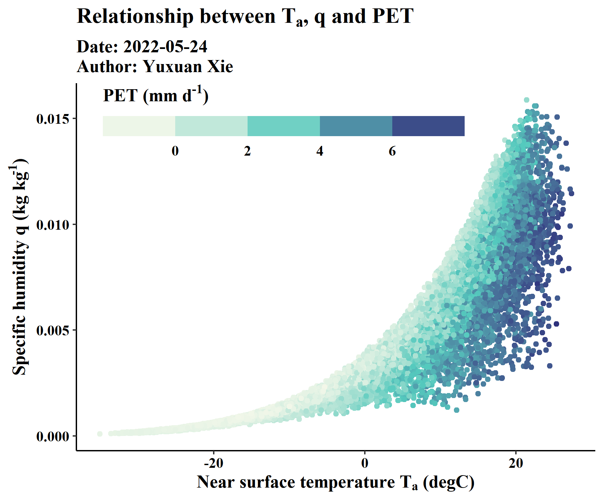

# Notes
My markdown notes

> test for figures

$PET=f(q,T_a)$

$$
PET=\frac{\Delta R_n}{\Delta+\gamma}+\frac{\gamma}{\Delta+\gamma}\frac{6.43(1+0.536U_2)VPD}{\lambda}
$$

# TO DO

- [ ] R for CUG_mail
- [ ] ET_summary
- [ ] 在wxf的基础上挖掘一下，华北地区ERA5L下降趋势，气象驱动贡献了多少