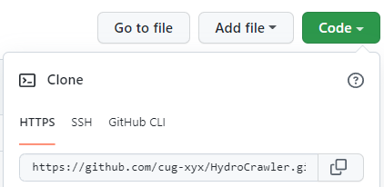

[toc]

# 2022-05-21 将远程仓库拖拽到本地

1. step1 创建一个新文件夹

2. 初始化成一个本地的git仓库（此时文件夹中会生成一个隐藏文件 .git ）

   ```git
   git init
   ```

3. 将本地仓库与远程仓库连接起来

   ```git
   git remote add origin https://github.com/xxx.git
   ```

   > 
   >
   > **远程仓库**

4. 使用命令查看是否连接成功

   ```git
   git remote show
   git remote -v
   ```

5. 执行拉取操作

   > 在此之前似乎需要**设置用户信息**（下方有）以及添加**ssh key**（网上随便搜索”github ssh key“）
   
   ```git
   # git pull <remote> <branch分支>
   git pull origin master
   ```

# 2022-05-21 将本地仓库更新到远程

1. 将文件同步到本地暂存区

   ```git
   git add <file>
   ```

2. 查看目前是否有未上传的文件等

   ```git
   git status
   ```

3. 为了在github中有提交记录，需要设置用户信息

   ```git
   git config --global user.name <github 用户名>
   git config --global user.email github <注册邮箱987569314@qq.com>
   ```

4. 填写本次暂存区要提交的文件的注释内容

   ```git
   git commit -m <注释内容>
   ```

5. (如果已有该仓库 可忽略)添加新的github仓库

   ```git
   git remote add <仓库小名> <连接>
   # example
   git remote add origin https://github.com/cug-xyx/repo_name.git
   ```

6. 提交到远程仓库（push）

   ```git
   git push <仓库小名> <分支名>
   # example 
   git push origin master
   ```

# 2022-05-21 关闭自动转换功能

> warning
>
> ```git
> warning: LF will be replaced by CRLF in demo.R.
> The file will have its original line endings in your working directory
> ```

```git
# 对当前仓库有效
git config core.autocrlf false
# 全局
git config --global core.autocrlf false
```

# 2022-05-22 一次性add全部文件

```git
git add --all
```

# 2022-08-15 服务器与github交互

1. 服务器上**git**为github**设置代理**

   ```
   # clone repo
   # 方案 底之前加 https://github.91chi.fun/
   # example
   git clone https://github.com/cug-xyx/hydroET.git
   # 更改地址
   git clone https://github.91chi.fun/https://github.com/cug-xyx/hydroET.git
   ```

   此时可能需要**token**，`github`->`setting`->`Developer settings`->`Personal access tokens`->`Generate new token`获取一个**token**

   - 注意：获取**token**后需立即保存，它将不会再次出现

   ```
   # push 到 github
   git push -u my_origin main
   //Username for 'https://github.com': cug-xyx <your github name>
   //Password for 'https://yzmhust@gmai.com@github.com': <your token>
   ```

2. 将token连接到远程仓库地址，从以上地址进行操作时不需要输入用户名与密码

   ```
   git remote set-url origin https://$token@github.com/<name>/<repo name>
   # example
   git remote set-url origin https://$<token>@github.91chi.fun/https://github.com/cug-xyx/hydroET.git
   ```


# 2022-08-15 GITHUB国内拒绝访问问题

>  仅介绍**Windows**解决办法，Linux同理

1. 以管理员身份打开**cmd**（或**power shell**、**Windows Terminal终端**）

2. 进入`hosts`文件路径，并打开`hosts`文件

   ```
   # Windows 常规路径
   >> cd C:/Windows/System32/drivers/etc/ # 进入路径
   >> notepad .\hosts                       # 打开文件
   ```

3. 将下方内容添加进`host`文件，并保存

   ```
   # update: 20220919
   # Github Hosts
   # domain: github.com
   140.82.113.4 github.com
   140.82.114.9 nodeload.github.com
   140.82.112.5 api.github.com
   140.82.112.10 codeload.github.com
   185.199.108.133 raw.github.com
   185.199.108.153 training.github.com
   185.199.108.153 assets-cdn.github.com
   185.199.108.153 documentcloud.github.com
   140.82.114.17 help.github.com
   
   # domain: githubstatus.com
   185.199.108.153 githubstatus.com
   
   # domain: fastly.net
   199.232.69.194 github.global.ssl.fastly.net
   
   # domain: githubusercontent.com
   185.199.108.133 raw.githubusercontent.com
   185.199.108.154 pkg-containers.githubusercontent.com
   185.199.108.133 cloud.githubusercontent.com
   185.199.108.133 gist.githubusercontent.com
   185.199.108.133 marketplace-screenshots.githubusercontent.com
   185.199.108.133 repository-images.githubusercontent.com
   185.199.108.133 user-images.githubusercontent.com
   185.199.108.133 desktop.githubusercontent.com
   185.199.108.133 avatars.githubusercontent.com
   185.199.108.133 avatars0.githubusercontent.com
   185.199.108.133 avatars1.githubusercontent.com
   185.199.108.133 avatars2.githubusercontent.com
   185.199.108.133 avatars3.githubusercontent.com
   185.199.108.133 avatars4.githubusercontent.com
   185.199.108.133 avatars5.githubusercontent.com
   185.199.108.133 avatars6.githubusercontent.com
   185.199.108.133 avatars7.githubusercontent.com
   185.199.108.133 avatars8.githubusercontent.com
   # End of the section
   ```

4. 刷新DNS（**Windows**下）

   ```
   ipconfig /flushdns
   ```

至此解决问题

## References

[管理员权限打开hosts文件](http://www.xiaobaixitong.com/help/38560.html)

[修改IP值内容](https://zhuanlan.zhihu.com/p/107334179)

[Windows下刷新DNS](https://www.cnblogs.com/jiannanchun/p/15397235.html)


