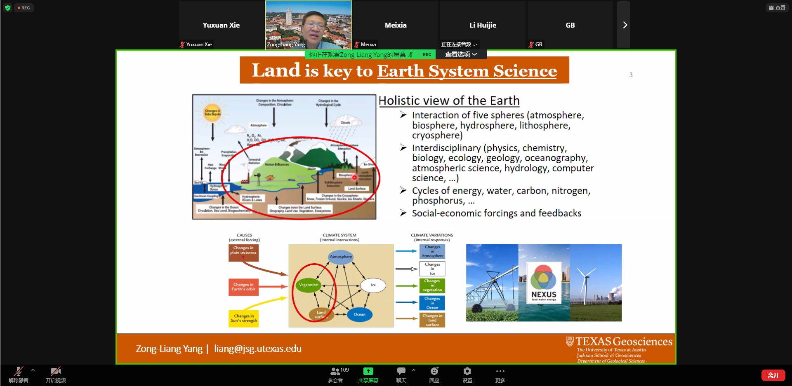
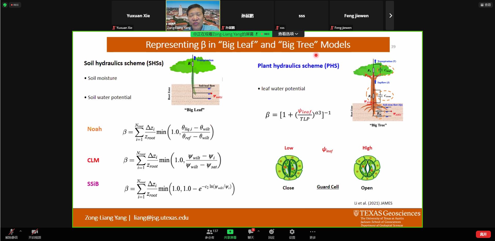

- CLM、Noah-MP

- 模型要注意的四个要素
  1. 观测数据
  2. 大气驱动
  3. 模型结构
  4. 模型参数

# 引用次数最多的两篇文献

# 多参数化框架（MP）

# Post-2011 Developments @UT-Austin

# "Big-Leaf" and "Big-Tree" theory

- 植被水文学需要14个参数

# Transpiration和GPP的评估

# PHS at FLUXNET

# $\beta$ in "Big Tree"

# Noah-MP-CN (Carbon and Nitrogen)

# WRF-Hydro-RAPID

- To forecast river flow

# Noah-MP_DART TWS

# New challenges in Noah-MP?

# New normal in Land Surface Modeling

