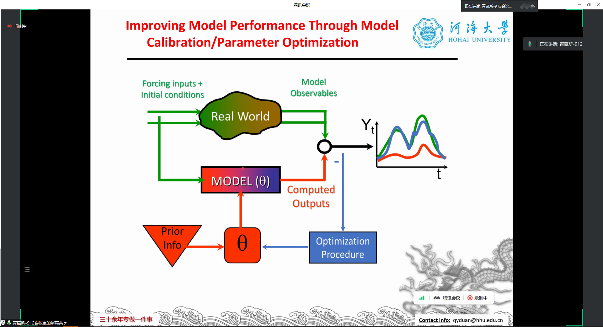
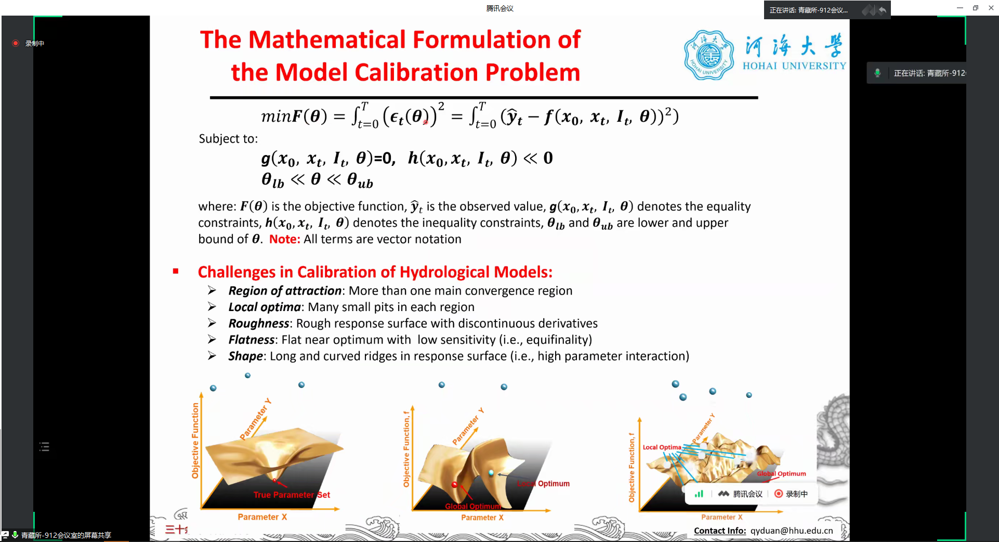
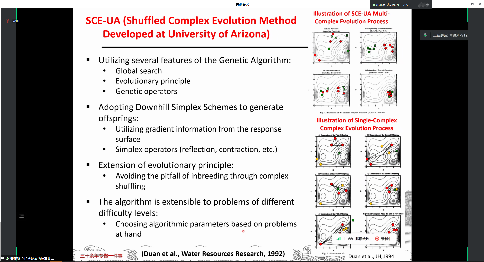
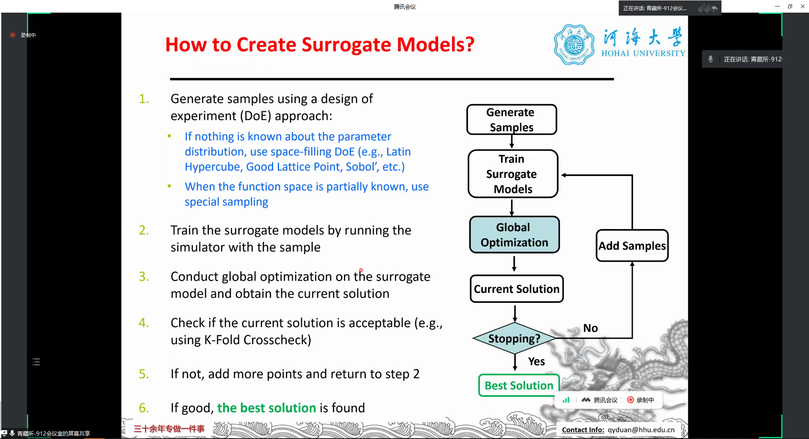
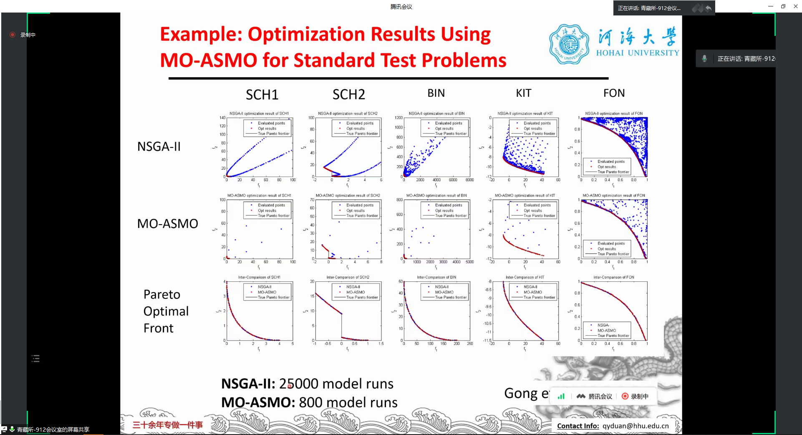
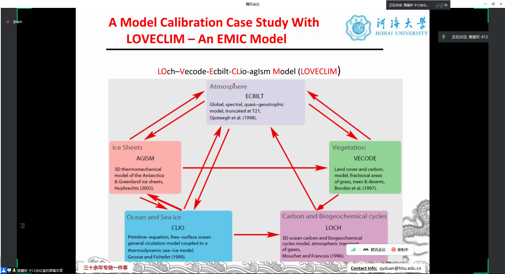

# 报告封面

# 笔记

主要工作——**模型参数率定**

- forward problem：预测
- inverse problem：调试模型

- 典型的inverse problem

- 将问题变成一个优化问题，让模拟的残差变得最小

传统方法（Local methods）：

- 梯度法
- 直接法

**参数超过五个以上，就无法找到全局最优解**

全局方法（Global methods）：

- Deterministic strategies
- 启发性方法（e.m., **SCE-UA**）

- 学会使用革命性的工具（如**ChatGPT、Copilot**）

- SCE-UA方法的延申
- **问题：**不适用于大计算量的方法

- 参数筛选
- 尽量减少维度
- 替代模型解

**参数筛选（敏感性分析）**

- CoLM——40个参数

- 通过计算敏感性指数筛选参数
- Local方法不够可靠

第三步：**建立替代模型**

- 不是替代动力过程，而是**替代误差曲面，替代动力模型和真实值的误差曲面**
- 通过选取有限样本点来替代曲面

## ASMO

- 在大复杂问题时使用ASMO可以大大减少工作量

多目标优化算法

- NSGA

### MO-ASMOGS

- 10%的网格可以完成全部网格的工作

- 首先对模型采样，得到替代模型，验证替代模型，知道解释度最高为止

- 仍无法解决Runoff率定问题

> Adaptive Surrogate Modeling-based Optimization (ASMO)

