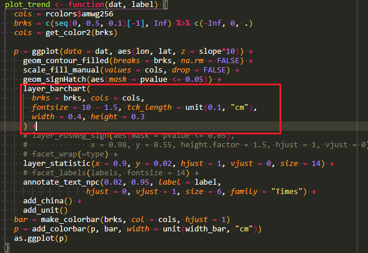
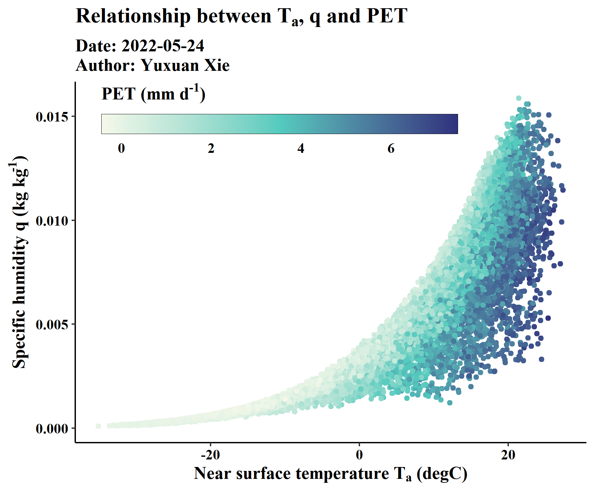

[toc]

# 2022-05-21 图中的柱状图副图

[gg.layers——gg_barchart](https://rpkgs.github.io/gg.layers/reference/layer_barchart.html)

> 需要`aes()`中有`z`



# 2022-05-22 ggplot中colorbar的两种画法（连续型变量）

- 画法1

  ```R
  fread('SITES_JRA55/50136.csv') %>%
    ggplot(aes(x = Tair, y = q)) + theme_classic() +
    geom_point(aes(color = PET)) +
    scale_color_gradientn(
      colours = hcl.colors(3, 'GnBu', rev = T),
      guide = guide_colorsteps(
        barwidth = 18,
        barheight = 1,
        title = expression(bold('PET (mm d'^'-1'*')')),
        title.position = 'top'
      )
    ) +
    theme(
      legend.position = c(0.4, 0.9),
      legend.background = element_blank(),
      legend.direction = 'horizontal',
      text = element_text(family = 'serif', face = 'bold', 
                          color = 'black', size = 13),
      axis.text = element_text(color = 'black')
    ) +
    labs(title = expression(bold('Relationship between T'['a']*', q and PET')),
         subtitle = 'Date: 2022-05-24\nAuthor: Yuxuan Xie',
         x = expression(bold('Near surface temperature T'['a']*' (degC)')),
         y = expression(bold('Specific humidity q (kg kg'^'-1'*')')))
  ```

> 

- 画法2

  ```R
  fread('SITES_JRA55/50136.csv') %>%
    ggplot(aes(x = Tair, y = q)) + theme_classic() +
    geom_point(aes(color = PET)) +
    guides(
      col = guide_colorbar(
        frame.colour = 'black',
        ticks.colour = NA,
        barheight = 1,
        barwidth = 18,
        title = expression(bold('PET (mm d'^'-1'*')')),
        title.position = 'top'
      )
    ) +
    scale_color_gradientn(
      colours = hcl.colors(3, 'GnBu', rev = T),
    ) +
    theme(
      legend.position = c(0.4, 0.9),
      legend.background = element_blank(),
      legend.direction = 'horizontal',
      text = element_text(family = 'serif', face = 'bold', 
                          color = 'black', size = 13),
      axis.text = element_text(color = 'black')
    ) +
    labs(title = expression(bold('Relationship between T'['a']*', q and PET')),
         subtitle = 'Date: 2022-05-24\nAuthor: Yuxuan Xie',
         x = expression(bold('Near surface temperature T'['a']*' (degC)')),
         y = expression(bold('Specific humidity q (kg kg'^'-1'*')')))
  ```

> 


